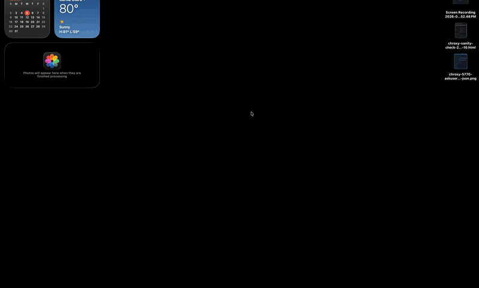
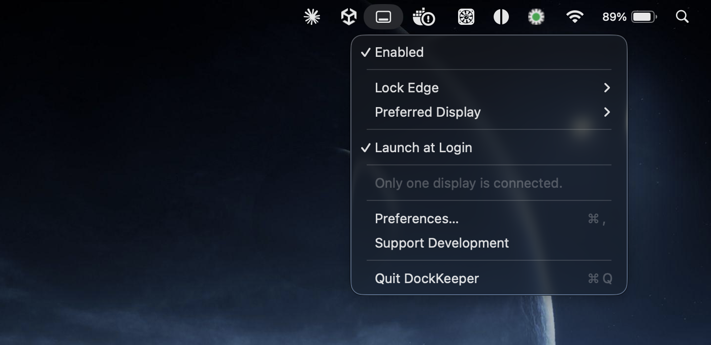
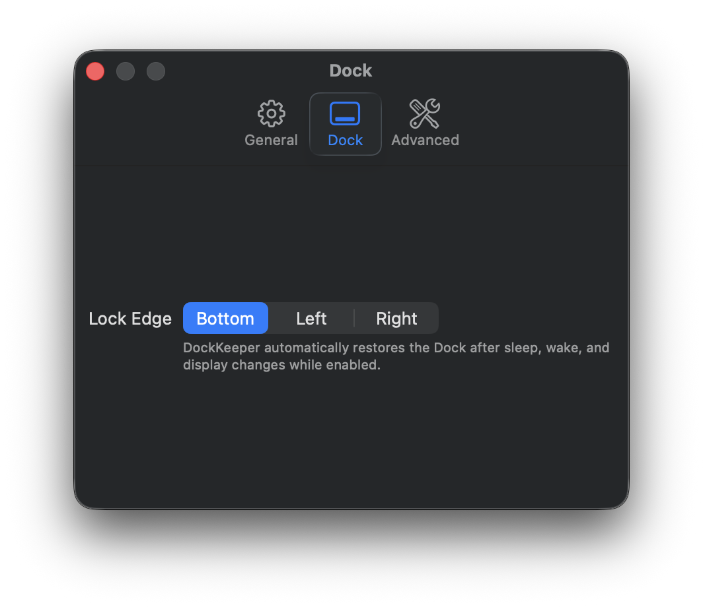
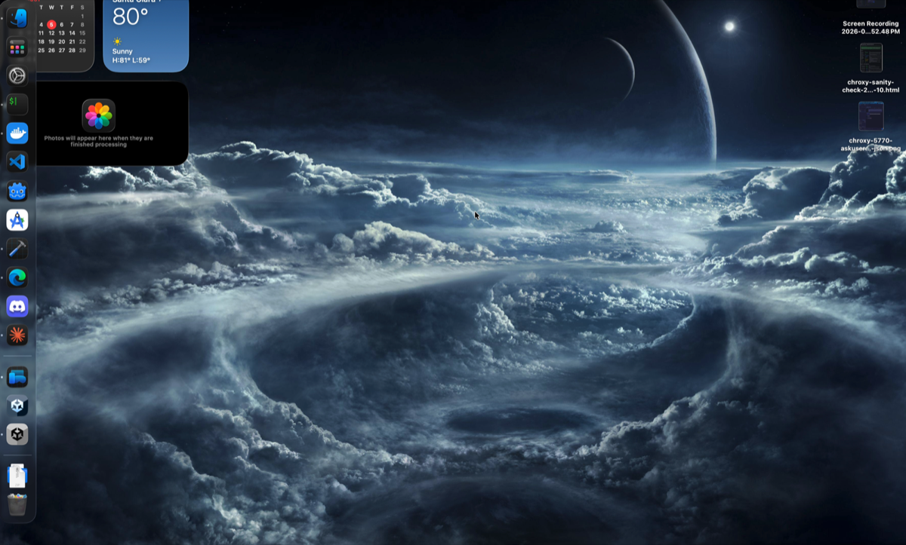
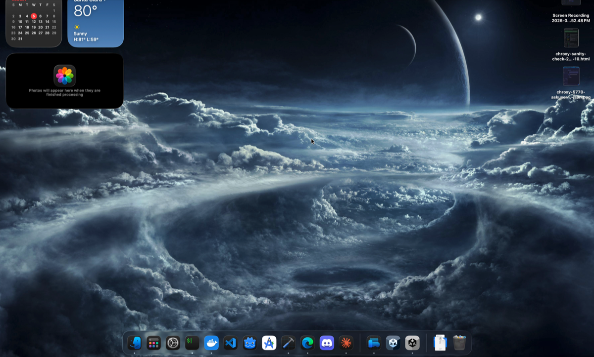

# DockKeeper

**Free, open-source macOS utility that keeps your Dock on the edge and display you chose.**

[](https://github.com/blamechris/DockKeeper/actions/workflows/ci.yml)
[](LICENSE)
[](https://github.com/blamechris/DockKeeper/releases)

<p align="center">
  
</p>
<p align="center"><em>DockKeeper returning the Dock to its configured bottom edge — displaced here with
<code>defaults write … && killall Dock</code>, snapped back in under two seconds.</em></p>

**No subscriptions, no telemetry, no ads, no required permissions.**

> 🚧 **v0.9 public beta** — feature-complete for v1.0; the multi-monitor
> hardware test matrix is still being worked through. Signed and notarized.

## Why DockKeeper

macOS loves to relocate the Dock — after sleep, display changes, or when you least expect it. DockKeeper watches for those events and puts the Dock back on your preferred edge and display, silently. Compared to the usual workarounds:

- **No Dock restart.** The classic fix — `defaults write com.apple.dock orientation left && killall Dock` — kills and relaunches the Dock every time. DockKeeper repositions it live through the `CoreDock` API, flicker-free, and keeps the `defaults`/`killall` route only as a runtime fallback.
- **Event-driven, not a polling loop.** It reacts to sleep, wake, display, and preference events instead of running a timer.
- **Nothing taken on trust.** No telemetry and no network code — and CI fails the build if a networking symbol, raw socket syscall, or networking framework shows up in either binary ([the gate](.github/workflows/ci.yml), [privacy statement](PRIVACY.md)).
- **No required permissions.** Everything core runs with zero privacy-gated permissions. One optional feature (Keep windows in place) asks for Accessibility, and only if you turn it on.
- **It won't fight your Mac.** An oscillation guard backs off instead of dueling other Dock-moving software, and cases macOS doesn't allow (a bottom Dock pinned while *separate Spaces* is on) get an explanation instead of a fight.

An evidence-labeled, feature-by-feature comparison with the commercial alternative in this space lives in [docs/parity-assessment.md](docs/parity-assessment.md).

## Screenshots

| The menu-bar menu | Preferences ▸ Dock |
|---|---|
|  |  |

| Dock pushed to the left edge… | …and back on its configured bottom edge |
|---|---|
|  |  |

*Stills from the same session as the recording above: the Dock is moved off its configured edge (simulated with `defaults`/`killall`), and DockKeeper puts it back.*

## Install

**Download:** grab the notarized `DockKeeper-x.y.z.dmg` from [Releases](https://github.com/blamechris/DockKeeper/releases), drag `DockKeeper.app` to Applications (required for Launch at Login), and optionally copy `dockkeeper` somewhere on your `PATH`.

**Homebrew:**

```sh
brew install --cask blamechris/tap/dockkeeper
```

**Requirements:** macOS 14+ · Apple Silicon (primary) or Intel (best effort).

## Features

- Lock the Dock to **Bottom**, **Left**, or **Right** — flicker-free live repositioning
- Automatic recovery after sleep, wake, display plug/unplug, resolution and arrangement changes — with burst coalescing, a retry ladder for slow wakes, and an oscillation guard that refuses to fight other software
- **Preferred display:** keep the Dock on a chosen monitor. Works with *Displays have separate Spaces* **on** (the macOS default) for left/right Docks, and for any edge with it off
- Displays recognized by a **multi-signal fingerprint** (survives docks, adapters, and UUID churn; never guesses between identical monitors)
- **Keep windows in place** (opt-in): restores your window layout after a display pin — the only feature that uses a permission (Accessibility), strictly optional
- **Pause** (15 min / 1 hour / until resumed) for temporary Dock moves, with an optional global hotkey (⌃⌥⌘D, off by default)
- **Hide the Dock while screen sharing** (opt-in)
- Automation: `dockkeeper` CLI, a `dockkeeper://` URL scheme, and Apple Shortcuts intents
- Menu-bar app that stays out of your way (`.accessory` — no Dock icon of its own); **Launch at Login** via Apple's supported `SMAppService`
- Opt-in, bounded, local-only diagnostics file for bug reports — nothing ever leaves your Mac ([privacy statement](PRIVACY.md))

> **How pinning works:** macOS ties the Dock to the *main* display, so pinning
> re-bases which display is main. With separate Spaces **off** that also moves
> the menu bar (expected); with it **on** (default), every display keeps its own
> menu bar and left/right Docks pin cleanly — a bottom Dock can't be pinned in
> that mode, and DockKeeper says so instead of fighting the OS.
>
> **This change is permanent, and turning DockKeeper off does not undo it.**
> Pinning writes the display arrangement the same way System Settings does, so
> your chosen display stays the main one after you disable or uninstall
> DockKeeper. That is deliberate — silently rearranging your displays at quit
> would be worse — but it means the setting outlives the app. To put it back,
> drag the white menu-bar strip in System Settings › Displays › Arrange.
> **Edge locking alone changes nothing permanently**; only preferred-display
> pinning does.

### Planned

- Bottom-Dock pinning in separate-Spaces mode (mechanism research ongoing)
- Follow mouse / active window / active app
- Raycast extension; Shortcuts app discovery (the intents exist; the metadata packaging lands in v1.1 — the URL scheme works today)

## Automation

The CLI and the app share one settings store, so either can drive the other:

```sh
dockkeeper lock left
dockkeeper unlock
dockkeeper status
```

The same commands are available as a URL scheme, for Shortcuts, Raycast, Alfred,
or anything else that can open a URL:

```
dockkeeper://lock?edge=bottom|left|right
dockkeeper://unlock
dockkeeper://pause              (until resumed)
dockkeeper://pause?minutes=15   (capped at 24h)
dockkeeper://resume
```

> **Note on the URL scheme:** it is unauthenticated by design — any process on
> your Mac that can open a URL can unlock or pause DockKeeper, with no prompt.
> The worst case is that your Dock stops being held in place, and anything able
> to run `open` on your Mac can already do more than that. It reads and changes
> nothing else, and it is never reachable from the network. If you would rather
> not have the surface at all, delete the `CFBundleURLTypes` key from
> `DockKeeper.app/Contents/Info.plist` — everything else keeps working.

## Build & Run

Building from source needs a Swift 6 toolchain (Xcode 26 / Swift 6.3):

```sh
# Build everything
swift build

# Run the menu-bar app
swift run DockKeeper

# Use the CLI (build product is `dockkeeper-cli`; ships as `dockkeeper`)
swift run dockkeeper-cli status
swift run dockkeeper-cli lock left

# Run tests
swift test
```

### Build the app bundle

SwiftPM produces a bare executable; the bundle script wraps it into a proper
`DockKeeper.app` (with `Info.plist` + entitlements) and ad-hoc code-signs it:

```sh
# Build dist/DockKeeper.app
Scripts/build-app.sh            # release; use "debug" for a faster loop

# Build and launch it
Scripts/run-app.sh

# One-shot status report (handy for bug reports)
dist/DockKeeper.app/Contents/MacOS/DockKeeper --diagnostics
```

> **Launch at Login note:** macOS registers login items through Background Task
> Management, which requires the app to live in **`/Applications`** with a full
> signature. From a dev build directory (or with an ad-hoc signature) the status
> reads `notFound` and the app tells you to move it to Applications. Everything
> else — menu bar, edge lock, preferred display — works from anywhere.

## Architecture

```
DockKeeperCore   — shared engine (no UI deps; used by app + CLI)
├── Dock         — DockController, DockMonitor, CoreDock bridge, orientation model
├── Display      — DisplayManager (UUID-stable display identification)
└── Core         — Settings, logging
```

`DockKeeper` is the menu-bar app (SwiftUI `MenuBarExtra` + preferences); `dockkeeper-cli` is the command-line front end. The Dock is repositioned via the private `CoreDock` C API (`CoreDockSetOrientationAndPinning`), resolved at runtime with `dlsym` so a future macOS change degrades gracefully to the `defaults write com.apple.dock orientation` + `killall Dock` fallback.

### Documentation

The design docs under [`docs/`](docs/) are the contract for this repo (see [AGENTS.md](AGENTS.md)):

- [Behavior specification](docs/behavior-specification.md) — what the app does, edge case by edge case
- [Technical design](docs/technical-design.md) — architecture and mechanisms
- [Decision log](docs/decision-log.md) — ADRs, including the one ratified private-API exception
- [Parity assessment](docs/parity-assessment.md) — evidence-labeled comparison with the commercial alternative
- [Release checklist](docs/release-checklist.md) — the signed/notarized two-ticket release pipeline
- [CHANGELOG.md](CHANGELOG.md) — release history

## Contributing, security, license

- [CONTRIBUTING.md](CONTRIBUTING.md) — build, test, and PR conventions
- [SECURITY.md](SECURITY.md) — how to report a vulnerability (privately, please)
- [PRIVACY.md](PRIVACY.md) — the "nothing ever leaves your Mac" statement, and how to verify it yourself
- MIT © 2026 blamechris — see [LICENSE](LICENSE)
