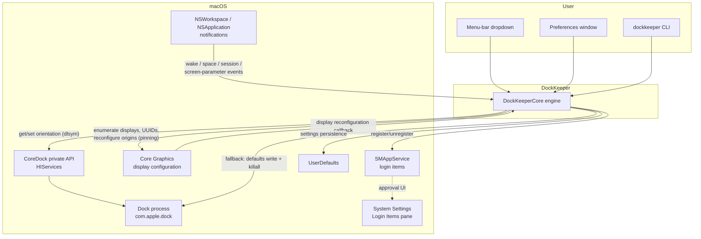
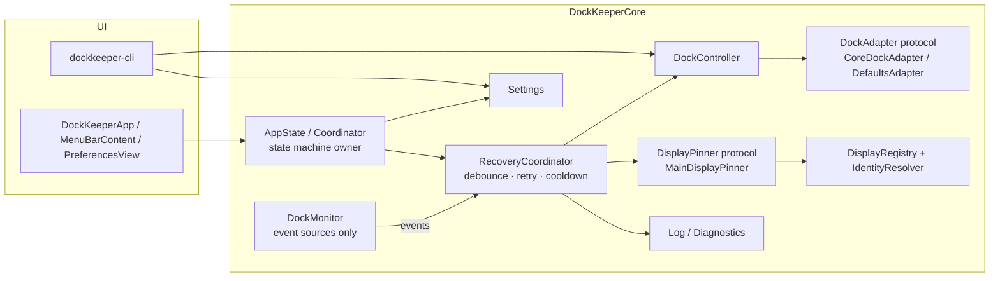
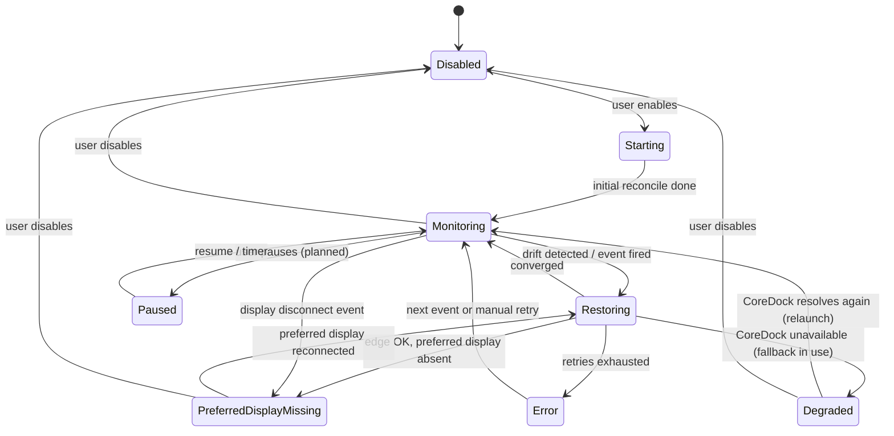

# DockKeeper — Technical Design Document

| | |
|---|---|
| **Status** | Draft for review |
| **Date** | 2026-07-22 |
| **Owner** | blamechris |
| **Scope** | v1.0 (edge lock + best-effort preferred display) and the hardening work between the current v0.1 scaffold and v1.0 |
| **Inputs** | [Preferred-display spike](spikes/preferred-display-spike.md) (owner decisions recorded 2026-07-22), the DockKeeper Agent Kickoff Package, the v0.1 codebase |

Every product or technical claim in this document carries one of the kickoff package's evidence labels:

- **CONFIRMED** — verified on-device, by Apple documentation, or by a reproducible experiment
- **INFERRED** — reasoned from confirmed facts, not yet observed
- **PROPOSED** — a design choice this document is making
- **UNKNOWN** — needs investigation before it can be relied on

---

## 1. Executive Summary

**The problem.** macOS relocates the Dock — after sleep/wake, display plug/unplug, resolution and arrangement changes — and offers no built-in way to say "keep the Dock here." Commercial utilities that fix this are paid, closed-source, and often subscription-gated. DockKeeper is a free, MIT-licensed, native alternative with no telemetry, no accounts, and no network use.

**The approach.** A menu-bar accessory app plus a CLI, both driving a shared engine (`DockKeeperCore`):

- **Edge lock** (the headline, always-reliable feature): the Dock's edge (bottom/left/right) is read and set live via the private `CoreDock` C API, resolved at runtime with `dlsym`, with a `defaults write com.apple.dock orientation` + `killall Dock` fallback if the symbols ever disappear. CONFIRMED working on-device.
- **Preferred display** (best-effort): the Dock lives on macOS's *main* display, so pinning is implemented by making the chosen display the main display via public `CGDisplayConfiguration` APIs. This also moves the menu bar — an accepted, documented consequence — and is declined (with an explanation) when "Displays have separate Spaces" is on. Owner decisions 1–3 in the spike. Mechanism CONFIRMED available; multi-monitor behavior INFERRED, not yet hardware-verified.
- **Recovery**: event-driven monitoring (wake, display reconfiguration, Space changes, session activation) with a low-frequency polling safety net.

**Major constraints.**

1. There is **no public API to set the Dock's display or edge**; `CoreDock` is private, and the only public path to a different display is relocating the main display. CONFIRMED (spike).
2. "Displays have separate Spaces" (macOS default: ON) makes the Dock per-display/pointer-following; DockKeeper does not fight the OS in that mode. CONFIRMED default, owner Decision 2A.
3. Private-API use and `killall Dock` make the **App Sandbox / Mac App Store non-viable** for v1. INFERRED (see §13).

**Major unresolved risks.** Multi-monitor pinning behavior is reasoned but never observed on real hardware (the dev rig has one display); display-UUID stability across reconnects/adapters is UNKNOWN; `CoreDock` symbols could change in a future macOS (mitigated by the fallback path).

**Why this approach.** Every alternative was worse: Accessibility-driven Dock dragging needs a heavyweight permission and is fragile; `defaults`+restart as the *primary* mechanism flickers and kills Dock state; cursor-warping hijacks the pointer; private SkyLight pinning was explicitly rejected by the owner. The chosen design keeps the reliable 90% (edge lock) on a proven mechanism with a public-API fallback, and ships the honest 10% (pinning) as clearly-communicated best-effort. Notably, **no Accessibility permission is required at all** for v1 (§10) — a significant simplification over the kickoff package's assumptions.

---

## 2. Goals and Non-Goals

### Goals (v1.0)

| ID (seed) | Goal |
|---|---|
| DK-FR-001 | Lock the Dock to a chosen edge (bottom/left/right) and restore it whenever macOS moves it |
| DK-FR-002 | Best-effort preferred-display pinning via main-display relocation, honestly gated and explained |
| DK-FR-003 | Recover after sleep/wake, display connect/disconnect, resolution and arrangement changes |
| DK-FR-004 | Enable/disable at any time; disabled means DockKeeper touches nothing |
| DK-FR-005 | Launch at Login via `SMAppService` |
| DK-FR-006 | Menu-bar controls (accessory app, no Dock icon) + Preferences window |
| DK-FR-007 | CLI (`dockkeeper lock/unlock/status`) sharing the same engine and settings |
| DK-NFR-001 | ~0% idle CPU, no visible Dock oscillation, no flicker on the primary path |
| DK-NFR-002 | Zero network communication during normal operation |
| DK-PRIV-001 | No telemetry, analytics, or accounts; local logs only, opt-in verbose |

(Seed IDs to be formalized in `docs/behavior-specification.md`; see Appendix B.)

### Non-Goals (v1.0)

- Follow-mouse / follow-focused-window / follow-active-app modes (deferred; follow-window would introduce the Accessibility permission we currently avoid)
- Window management or display-arrangement management as a feature
- Apple Shortcuts, Raycast, AppleScript integration
- Per-app rules, display profiles, work/home automation
- Mac App Store distribution (blocked by mechanism choices, §13)
- Auto-update (v1 ships via Homebrew/direct download; Sparkle is a later ADR)
- Cloud sync, accounts, remote configuration, enterprise management, plugins
- Fighting "Displays have separate Spaces": when ON, pinning is declined and explained (Decision 2A)
- Perfect pinning in every topology — "reliable and honest" beats "beats every macOS limitation" (Decision 3)

---

## 3. System Context



Interactions worth noting:

- **Dock**: never touched directly; always via `CoreDock` (live) or its own preferences + restart (fallback).
- **Accessibility services**: *not used* in v1 (§10). The kickoff package anticipated them; the chosen mechanisms make them unnecessary.
- **System Settings**: only ever *opened for* the user (Login Items approval); nothing is changed on their behalf.
- **Network**: no component makes network requests. The "Support Development" menu item opens the GitHub page in the user's browser — the only outbound anything, and it is user-initiated. CONFIRMED (code inspection).

---

## 4. Architecture

### 4.1 Component inventory

The kickoff package proposed eleven components. The table maps each to what exists in v0.1 and what v1.0 needs. Status: ✅ built · 🟡 partial · ❌ missing.

| Kickoff component | v0.1 counterpart | Status | v1.0 work |
|---|---|---|---|
| ApplicationCoordinator | `AppState` (app), `main.swift` (CLI) | 🟡 | Absorb state machine (§6); observe external `UserDefaults` changes so CLI edits reflect in the running app |
| DockPlacementController | `DockController` | ✅ | Put `CoreDock`/defaults/`killall` behind a `DockAdapter` protocol for testability |
| DockStateObserver | `DockMonitor` | 🟡 | Split observation from recovery; add debounce/coalescing; detect Dock process restart |
| DisplayRegistry | `DisplayManager` | 🟡 | Cache snapshots; emit change events; real display names via `NSScreen.localizedName` |
| DisplayIdentityResolver | `DisplayIdentityResolver` + `FingerprintMatcher` | ✅ (2026-07-23) | Fingerprint + scored matching + repair shipped (§7); thresholds tune on M6 hardware |
| RecoveryCoordinator | inlined in `DockMonitor.restoreSoon` + poll | ❌ | Extract: single owner of reconciliation with retry ladder, cooldown, oscillation guard (§8) |
| PermissionManager | — | n/a | Not needed for v1 (§10); introduce only if follow-window ships later |
| LoginItemManager | `LoginItemManager` | ✅ | — |
| PreferencesStore | `Settings` | ✅ | Add new keys (§12); schema-version key for future migration |
| MenuBarController | `DockKeeperApp` + `MenuBarContent` | 🟡 | Distinct enabled/disabled icon; honor (or remove) the unused `showMenuBarIcon` setting |
| DiagnosticsLogger | `Log` (os.Logger) | 🟡 | Optional bounded on-disk diagnostics file + export action (§12, §11) |

### 4.2 Target component diagram



### 4.3 Per-component contracts

For each component: responsibility / inputs / outputs / dependencies / threading / failure modes / test seam.

**DockController** — decides whether the Dock needs moving and applies the edge.
Inputs: desired `DockOrientation`, `Settings`. Outputs: applied/no-op, current orientation. Depends on `DockAdapter`. Threading: callable from any context today (`@unchecked Sendable`); PROPOSED: invoked only by `RecoveryCoordinator` (main actor) and the CLI. Failure modes: adapter read returns nil (unknown state — treat as drift, apply); private API vanished (fall back, log `Degraded`). Test seam: inject a fake `DockAdapter` recording get/set calls. **(Seam missing in v0.1 — `CoreDock` is a static enum and `killall` is spawned inline. Priority refactor.)**

**CoreDockAdapter (`CoreDock`)** — runtime-resolved private `CoreDockGet/SetOrientationAndPinning`.
CONFIRMED: symbols resolve and work live, flicker-free, on-device — *but only when HIServices/AppKit is loaded in the process*. The CLI currently gets this transitively; the spike recommends an explicit `dlopen` of HIServices to remove the hidden link-order dependency. PROPOSED: do that hardening now (cheap, spike-validated).

**DefaultsAdapter** — `defaults write com.apple.dock orientation` + `killall Dock`.
Robust but restarts the Dock (visible). Used only when `CoreDock` is unavailable → app enters `Degraded` state and says so in the menu.

**DockMonitor** — event sources only (post-refactor): workspace notifications, screen-parameter notification, `CGDisplayRegisterReconfigurationCallback`, Dock-restart detection (§8.5). Outputs: typed `DockEvent` values to the coordinator. Main actor. Failure mode: callback registration fails → poll covers the gap. Test seam: events are plain values; the coordinator is tested by feeding synthetic sequences.

**RecoveryCoordinator** (new) — the *single owner* of reconciliation. Consumes events, applies debounce/coalescing, runs the retry ladder, enforces cooldown and the oscillation guard, invokes `DockController` and `DisplayPinner`, transitions the state machine. Main actor; pure decision core (`decide(state, event, now) -> [Action]`) unit-testable with no system dependencies. This is where most of the kickoff package's §6.8 requirements land.

**DisplayRegistry / DisplayIdentityResolver** — enumeration (`CGGetActiveDisplayList`, CONFIRMED), UUID mapping (`CGDisplayCreateUUIDFromDisplayID`, CONFIRMED), plus the fingerprint/scored-matching design in §7.

**MainDisplayPinner** — implements `DisplayPinner`. Pure `decide(snapshot, targetUUID)` (unit-tested today, ✅) + injected `applyMain` closure performing the `CGDisplayConfiguration` transaction. Failure modes are typed (`PinOutcome`) and every non-`pinned` case is a safe no-op with user-facing copy.

**LoginItemManager** — `SMAppService.mainApp`; system is the source of truth; maps `.requiresApproval`/`.notFound` to user guidance. CONFIRMED working; `.notFound` occurs under `swift run` because `SMAppService` needs the packaged `.app` (documented in-code).

**Settings** — `UserDefaults`-backed, registration-domain defaults, no SwiftUI dependency so the CLI can use it. ✅

**Log / Diagnostics** — `os.Logger` subsystem `com.dockkeeper.app` (on-device only, viewable in Console). PROPOSED addition: opt-in bounded file diagnostics (§12) because os_log retention is short and users filing GitHub issues need something to attach.

---

## 5. Dock State Model

### 5.1 Application state machine

The kickoff package's state list, adapted: `Awaiting Permission` is dropped for v1 (no permission exists to await; it returns if a follow-window feature ever ships).



States (all PROPOSED except where noted):

| State | Meaning | User-visible |
|---|---|---|
| Disabled | `Settings.isEnabled == false`; no observers, no timers, zero footprint | Menu toggle off (exists in v0.1) |
| Starting | Observers registering, initial reconcile scheduled | — |
| Monitoring | Steady state; event-driven, poll safety net | Normal icon |
| Restoring | A reconcile pass is in flight (retry ladder may be active) | — (must be invisible; no oscillation) |
| PreferredDisplayMissing | Edge enforced; pin target not connected — **no fallback pinning occurs** (§7.4) | Menu note: "preferred display isn't connected" (copy exists in v0.1) |
| Degraded | Private API unavailable; `defaults`+restart fallback active | Menu note; CLI `status` already reports this (v0.1 ✅) |
| Paused | Temporarily suspended without losing settings (planned affordance, e.g. "Pause for 1 hour") | Distinct icon |
| Error | Retry ladder exhausted without convergence | Menu note + last error |

### 5.2 Tracked state

| Field | Source | v0.1 |
|---|---|---|
| Current Dock edge | `CoreDock.current()` → fallback `com.apple.dock` defaults read | ✅ |
| Desired Dock edge | `Settings.lockEdge` | ✅ |
| Current main display | `CGMainDisplayID()` | ✅ |
| Preferred display | `Settings.preferredDisplayUUID` (fingerprint in v1, §7) | 🟡 UUID only |
| Separate-Spaces flag | `com.apple.spaces` `spans-displays` read | ✅ |
| Dock autohide | `CoreDockGetAutoHideEnabled` resolves (CONFIRMED, spike) — read-only awareness; DockKeeper never changes it | ❌ not wired |
| Pending restoration / attempt count / last outcome | RecoveryCoordinator | ❌ (needed for retry/cooldown) |
| Last pin outcome | `AppState.lastPinMessage` | ✅ |
| Login item status | `SMAppService.mainApp.status` (system is source of truth) | ✅ |

### 5.3 Reconciling incomplete or conflicting information

- `CoreDock.current()` returning nil (unresolvable symbols or unrecognized raw values) → treat orientation as **unknown**, fall back to the defaults read; if both fail, treat as drift and apply the desired edge (applying is idempotent and safe). PROPOSED.
- The defaults read can be **stale** relative to live Dock state (the Dock caches; `defaults` lags `CoreDock` writes). The live read always wins when available. INFERRED — verify with an experiment before relying on defaults reads for drift detection in `Degraded` state.
- During display reconfiguration, `CGMainDisplayID()` and `NSScreen.screens` can momentarily disagree with final layout. All decisions are made on a **snapshot** (`DisplaySnapshot`) captured at decision time, never on live queries mid-decision; the retry ladder re-snapshots. PROPOSED (snapshot pattern already exists for the pinner ✅).

---

## 6. (merged into §5)

*Numbering in this document follows content, not the kickoff outline, where merging avoided duplication. Appendix A maps every kickoff-required section to where it is covered.*

---

## 7. Display Identity

### 7.1 Available identifiers

| Identifier | API | Persistence | Status |
|---|---|---|---|
| Display UUID | `CGDisplayCreateUUIDFromDisplayID` | Survives reboots for the same display on the same connection in common cases | CONFIRMED available; **stability across reconnects/adapters/docks UNKNOWN** (single-display rig; kickoff explicitly warns not to assume) |
| CGDirectDisplayID | `CGGetActiveDisplayList` | **Not stable** across reconnects/reboots | CONFIRMED (Apple docs) |
| Vendor / model / serial | `CGDisplayVendorNumber` / `ModelNumber` / `SerialNumber` | Stable per panel; serial frequently 0 for consumer displays | CONFIRMED APIs exist; serial reliability INFERRED |
| Localized name | `NSScreen.localizedName` (matched via `NSScreenNumber`) | Human-stable ("DELL U2720Q") | CONFIRMED API (macOS 10.15+) |
| Built-in flag | `CGDisplayIsBuiltin` | Stable | CONFIRMED |

~~v0.1 stores the UUID string only and falls back to `"cg-<id>"`~~ **Fixed 2026-07-23**: preferences store the full `DisplayFingerprint`; `"cg-<id>"` placeholders are UI-only and discarded on migration; display names come from `NSScreen.localizedName`.

### 7.2 Fingerprint + scored matching (PROPOSED)

```swift
struct DisplayFingerprint: Codable {
    let uuid: String?
    let vendorNumber: UInt32?
    let modelNumber: UInt32?
    let serialNumber: UInt32?   // often 0 — treat 0 as absent
    let localizedName: String?
    let isBuiltin: Bool
}
```

Matching a stored fingerprint against connected displays:

| Evidence | Score |
|---|---|
| UUID exact match | 100 |
| vendor + model + serial (serial ≠ 0) | 85 |
| vendor + model + localizedName | 70 |
| vendor + model only | 50 |
| isBuiltin both true | 95 (there is at most one built-in) |

Accept the best candidate iff score ≥ 70 **and** it is the unique maximum. Two identical externals with serial 0 both score 50/70 and tie → ambiguous → treat as not-matched and surface "pick your preferred display again" rather than guessing. PROPOSED; thresholds to be tuned on hardware.

### 7.3 Stale-preference repair

When a fingerprint matches on fallback evidence but the stored UUID differs from the live UUID (dock/adapter changed the UUID), **rewrite the stored fingerprint** with the fresh values and log the repair. The preference heals instead of rotting.

### 7.4 When the preferred display is absent

**No fallback display is selected.** The Dock stays wherever macOS puts it (edge still enforced), state = `PreferredDisplayMissing`, and the pin re-applies on reconnect. Picking a "second best" display would surprise the user. PROPOSED (consistent with v0.1's `displayNotConnected` no-op behavior ✅).

---

## 8. Event Model & Recovery Algorithm

### 8.1 Event catalog

| Event | Source | v0.1 | Action |
|---|---|---|---|
| App launch / enable | — | ✅ | Full reconcile (edge + pin) after settle delay |
| Wake from sleep | `NSWorkspace.didWakeNotification` | ✅ | Reconcile with retry ladder (displays may not be ready — §8.4) |
| Screens wake | `NSWorkspace.screensDidWakeNotification` | ✅ | Reconcile |
| Display connect/disconnect/mode/desktop-shape | `CGDisplayRegisterReconfigurationCallback` (filtered to completed changes) | ✅ | Re-snapshot displays; reconcile; may enter/exit `PreferredDisplayMissing` |
| Resolution / arrangement changed | `NSApplication.didChangeScreenParametersNotification` | ✅ | Reconcile (coalesced with the CG callback — these fire together) |
| Active Space changed | `NSWorkspace.activeSpaceDidChangeNotification` | ✅ | Reconcile edge only (cheap read; usually no-op) |
| Session became active (fast user switching) | `NSWorkspace.sessionDidBecomeActiveNotification` | ✅ | Reconcile |
| Dock process restarted | ~~detection needed~~ **Resolved 2026-07-22**: spike CONFIRMED `CoreDockSet` writes through to defaults, so a restarted Dock re-reads the edge we set — restarts are benign; no detection mechanism needed (poll covers residual gaps) | n/a | — |
| Preference changed externally (CLI while app runs) | KVO on `UserDefaults` / `didChangeNotification` | ❌ | Refresh published state; reconcile if desired edge changed |
| Poll tick (safety net) | `Timer` | ✅ (2 s — too aggressive, see §8.6) | Silent drift check |
| Permission events | n/a in v1 | — | — |
| Fullscreen transition / focused-window change | not observed | — | Deliberately ignored in v1 (no follow-modes); fullscreen races are handled by the retry ladder, not by tracking fullscreen state |

### 8.2 v0.1 weaknesses this design fixes

1. **No coalescing**: every event schedules its own `asyncAfter(restoreDelay)`; a display reconfiguration burst (which fires the CG callback + screen-parameters + possibly space-change within milliseconds) stacks several overlapping restore attempts. Harmless today only because applies are idempotent — but it multiplies pin attempts, and each pin can itself emit a reconfiguration event.
2. **Feedback-loop exposure**: `MainDisplayPinner` completing a configuration *causes* a display-reconfiguration event, which triggers another reconcile. It converges (second pass hits `alreadyOnTarget`) — INFERRED, not proven — but the design should not rely on convergence-by-luck. The coordinator must mark self-caused reconfigurations and swallow their echoes.
3. **Fixed single delay**: one 0.4 s settle delay, no retries — a wake where displays come up slowly gets exactly one (possibly too-early) attempt, then waits for the 2 s poll to paper over it.
4. **No cooldown / oscillation guard**: if some other agent (another utility, a corporate profile) keeps moving the Dock, v0.1 fights it every 2 s forever, silently.

### 8.3 Reconciliation pseudocode (PROPOSED)

```text
on event e:
    if state in {Disabled, Paused}: return
    if e is displayReconfiguration and e.timestamp within ECHO_WINDOW
       of lastSelfInflictedReconfigure: return            # swallow our own echo
    pendingGeneration += 1
    schedule reconcile(gen: pendingGeneration) after DEBOUNCE (250–500 ms)
    # a newer event bumps the generation; stale reconciles no-op

reconcile(gen):
    if gen != pendingGeneration: return                    # coalesced away
    state = Restoring
    for attempt in retryLadder:                            # e.g. [0s, +1.5s, +4s]
        snapshot = captureSnapshot()                       # displays, main, edge, spaces
        actions = decide(snapshot, settings)               # pure function
        if actions is empty:
            state = deriveSteadyState(snapshot)            # Monitoring or PreferredDisplayMissing
            resetCooldownWindow(); return
        if cooldownExceeded():                             # e.g. >6 corrections in 60 s
            log oscillation warning; state = Error; return
        for a in actions:
            apply(a)                                       # setEdge via DockAdapter, or pin
            if a is pin: lastSelfInflictedReconfigure = now
        recordCorrection()
        wait attempt.delay                                 # then loop to verify convergence
    state = Error                                          # ladder exhausted

decide(snapshot, settings) -> [Action]:                    # PURE — unit-test target
    actions = []
    if snapshot.edge != settings.lockEdge: actions += setEdge(settings.lockEdge)
    if settings.preferredFingerprint != nil:
        match MainDisplayPinner.decide(snapshot, resolved(preferred)):
            .reconfigure(id) -> actions += pin(id)
            .terminal(_)     -> ()                         # no-op outcomes; message surfaced separately
    return actions
```

Key properties: **one reconcile in flight** (generation counter), **bounded work per event burst** (debounce), **verified convergence** (ladder re-checks after applying), **loop breaker** (cooldown budget), **echo suppression** (self-inflicted reconfigure window).

### 8.4 Timing parameters

| Parameter | Default | Rationale |
|---|---|---|
| Debounce window | 400 ms | Events around a display change arrive in bursts; UNKNOWN exact spread — measure in a spike |
| Retry ladder | 0 s, +1.5 s, +4 s | Covers wake-before-displays-ready; PROPOSED, tune on hardware |
| Echo window | 2 s after self-caused reconfigure | INFERRED sufficient |
| Cooldown budget | max 6 corrections per 60 s → `Error` | Prevents infinite fights; user-visible |
| Poll interval | **30 s** (v0.1: 2 s — change) | See §8.6 |

All PROPOSED and stored in `Settings` (the keys exist: `restoreDelay`, `recoveryInterval`) so field-tuning needs no release.

### 8.5 Dock restart

**Resolved 2026-07-22 — CONFIRMED benign.** The on-device spike ([findings](spikes/coredock-defaults-persistence.md)) showed a live `CoreDock` set writes through to the `com.apple.dock` defaults within ~1.5 s (it even creates the key when unset). A restarted Dock therefore re-reads exactly the edge we last set: no mirroring, no Dock-restart detection needed.

### 8.6 Polling policy

Kickoff principle 19: no continuous polling unless events are shown insufficient. v0.1 polls every **2 s**, which inverts the burden of proof. The work per tick is two C calls (INFERRED negligible), but the principled design is:

- Events are primary; the poll is a **safety net for event gaps only** (missed callbacks, Dock restarts until §8.5 lands, anything unobserved).
- Default interval 30 s. A wrong Dock edge for ≤30 s in the rare unobserved case is acceptable; burning wakeups every 2 s forever is not.
- Record (locally) whenever the *poll* — not an event — catches drift. If hardware testing shows real gaps, shorten with evidence in hand. → ADR-005 (hybrid monitoring).

---

## 9. Concurrency

- **Main actor owns everything mutable.** `AppState`, `DockMonitor`, and the new `RecoveryCoordinator` are `@MainActor`. There is exactly one owner of reconciliation state (the coordinator), satisfying the kickoff's "single owner" requirement. The workload is trivially small; there is no justification for background queues and their races.
- **Pure cores.** `MainDisplayPinner.decide` (exists ✅) and `RecoveryCoordinator.decide` (new) are pure synchronous functions — no actors, no awaits — so tests need no concurrency machinery.
- **CG callback trampoline.** `CGDisplayRegisterReconfigurationCallback` invokes a C callback; v0.1 hops to the main actor via `Task { @MainActor in ... }` (✅ correct). The `Unmanaged.passUnretained` pattern requires `stop()` before release; v0.1 documents this. PROPOSED hardening: coordinator owns monitor lifetime explicitly (start/stop paired with state transitions).
- **Overlap protection** comes from the generation counter (§8.3), not locks: a reconcile that awaits its ladder delay re-checks its generation on resume and abandons itself if superseded. Cancellation is cooperative and trivial.
- **`DockController` Sendable status**: currently `@unchecked Sendable` so the CLI (no main actor) can use it. Acceptable: it is stateless apart from injected `Settings`, and `Settings`/`UserDefaults` are thread-safe. Document rather than fight.
- **Timers**: the poll timer runs on the main run loop in `.common` mode (✅ survives menu tracking).

---

## 10. Permissions

**v1 requires no privacy-gated permission at all.** This is a meaningful improvement over the kickoff package's assumption that Accessibility permission was likely.

| Mechanism | Permission | Status |
|---|---|---|
| `CoreDock` get/set via `dlsym` | None | CONFIRMED on-device (works with no Accessibility grant) |
| `defaults` read/write `com.apple.dock` + `killall Dock` | None (outside sandbox) | CONFIRMED (standard Unix; same-user signal) |
| `CGGetActiveDisplayList` / UUIDs / `CGDisplayConfiguration` | None | CONFIRMED (public CG API; no TCC prompt) |
| Workspace/display notifications | None | CONFIRMED |
| `SMAppService` login item | User approval in System Settings (not a TCC permission) | CONFIRMED; `.requiresApproval` is detected and the app deep-links the user to the Login Items pane with an explanation (✅ v0.1) |

Consequences:

- No onboarding permission flow, no denied/revoked states, no `PermissionManager` — Milestone 5 of the kickoff plan collapses into "Login Items approval UX," which is already built.
- The unused `Log.accessibility` category is kept for the future follow-window feature, which *would* require Accessibility (`AXUIElement` for focused-window geometry). If that ships, the kickoff's full permission model (contextual explanation before prompting, denial UX, revocation detection) applies, and `Awaiting Permission` returns to the state machine. Deferred by design.

---

## 11. Persistence

`UserDefaults` (standard domain for the app/CLI; both processes share it because they run as the same user — CONFIRMED by the shared-`Settings` design working across app and CLI).

| Key | Default | Exists | Notes |
|---|---|---|---|
| `enabled` | `true` | ✅ | |
| `lockEdge` | `.bottom` | ✅ | Int raw value matching CoreDock integers |
| `preferredDisplayUUID` | nil | ✅ legacy | Superseded 2026-07-23 by `preferredDisplayFingerprint` (Codable, §7.2); migrated write-once (`"cg-"` values discarded) and mirrored for rollback until v1.1 |
| `preferredDisplayFingerprint` | nil | ✅ | JSON-encoded `DisplayFingerprint` (ADR-004) |
| `autoRecover` | `true` | ✅ | Gates the poll only in v0.1 — **retire per ADR-007** (2026-07-22): `enabled` is the single switch; key removed with M4 |
| `launchAtLogin` | `false` | ✅ | Mirror only — `SMAppService` is the source of truth; keep for UI restore, never trust over the system |
| ~~`showMenuBarIcon`~~ | — | deleted | Removed 2026-07-23 (was dead in v0.1; a menu-bar-only app without its icon is unreachable) |
| `verboseLogging` | `false` | ✅ | Surfaced in Preferences ▸ Advanced (2026-07-23) |
| `restoreDelay` | 0.4 | ✅ | Becomes debounce/ladder base (§8.4) |
| `recoveryInterval` | 30.0 | ✅ | Poll interval per §8.6 (shipped 2026-07-22) |
| `diagnosticsFileEnabled` | `false` | ✅ | Opt-in bounded file log (2026-07-23) |
| `settingsVersion` | 1 | ✅ | Migration hook (2026-07-23) |
| Donation prompt state | — | — | **Deliberately absent.** No automatic donation prompt exists, so no state is needed (kickoff §6.11: default no prompt — we exceed this by having no prompt at all; the "Support Development" menu item is passive) |

Onboarding-completion flag: not needed (no onboarding flow; the app is functional on first launch with zero prompts).

---

## 12. Privacy and Security

| Kickoff requirement | Status |
|---|---|
| No telemetry / analytics / accounts / remote backend | CONFIRMED — no networking code exists; the only URL open is user-initiated (GitHub) |
| No browsing-history access, no window-title storage | CONFIRMED — no such APIs referenced |
| No sensitive names in logs | ✅ Log lines use `privacy: .public` only on non-sensitive values (edge names, event names, display IDs — numeric) |
| Local diagnostics can be disabled | ✅ os_log debug is opt-in via `verboseLogging`; new file diagnostics opt-in |
| Bounded log retention | os_log: system-managed ✅. New diagnostics file: ring-buffer, cap ~1 MB / 7 days, PROPOSED |
| Security posture | No elevated privileges, no helper tools, no XPC surface, no input monitoring. `dlsym` of `CoreDock` executes in-process with user privileges only. Hardened runtime + notarization at distribution (§13). `killall` is invoked by absolute path (`/usr/bin/killall`) ✅ |

---

## 13. Distribution

| Channel | Verdict | Reasoning |
|---|---|---|
| **Developer ID direct download** (notarized `.dmg`/`.zip`) | **Primary — PROPOSED (ADR-002)** | No sandbox; private-API `dlsym` and `killall` both work; hardened runtime + notarization required and unproblematic (no entitlement conflicts known — INFERRED, verify at first notarization) |
| **Homebrew Cask** | **Yes, alongside direct** | Cask points at the notarized artifact; also solves the `dockkeeper` CLI install/symlink (build product is `dockkeeper-cli` to avoid the case-insensitive collision with the app binary — already handled ✅) |
| Mac App Store | **No for v1** | Sandbox blocks `killall` (signaling other processes) — CONFIRMED sandbox policy; private-API use fails review — CONFIRMED App Store policy; a CoreDock-free sandboxed build would have *no* working restore mechanism (defaults write to another app's domain + no restart = nothing). Revisit only if a supported mechanism appears |
| Source build (`swift build`) | Supported for developers | Documented caveat: `SMAppService` login item needs the packaged `.app` (✅ surfaced in-app today) |

Packaging status (updated after main's `72fbcc2` "Package as a signed DockKeeper.app bundle"): the bundle exists — `Scripts/build-app.sh` assembles `dist/DockKeeper.app` from the SwiftPM product with `Info.plist` (`LSUIElement=YES`, bundle id `com.dockkeeper.app`, macOS 14+) and ad-hoc signing against entitlements that document the intentional non-sandboxed stance; verified launching as a background accessory with CoreDock available. Remaining: app icon, Developer ID signing, notarization pipeline, cask formula, release checklist doc. Note: `SMAppService` reports `.notFound` for dev-directory builds — Background Task Management requires the app in `/Applications` with a full signature (CONFIRMED, documented in-app and in README). Auto-update: deferred; evaluate Sparkle post-v1 (ADR later — it adds a network call, which must remain user-consented to honor principle 9).

---

## 14. Performance Budget

Targets (kickoff §6.14) — all currently **unmeasured**; measurement is a Milestone-6 gate:

| Metric | Target | Expected | Notes |
|---|---|---|---|
| Idle CPU | ~0% | Event-driven + 30 s poll of two C calls → effectively 0 | Measure over 24 h; the v0.1 2 s poll would likely also pass but violates the principle |
| Memory | < 30 MB preferred | SwiftUI `MenuBarExtra` apps commonly land 25–50 MB — **target risk** | Measure; treat < 50 MB as acceptable, < 30 MB as stretch |
| Cold launch | < 1 s | INFERRED fine (tiny binary, no startup I/O beyond defaults) | Measure on base M-series |
| Network | 0 requests | CONFIRMED by construction | CI check: no networking symbols |
| Restoration latency | Edge restore visually instant (CoreDock is live) | CONFIRMED flicker-free on-device | Pin adds a display reconfigure — inherently visible (displays re-layout); not "flicker", but document |

---

## 15. Failure Modes

| Failure | Detection | Response | Status |
|---|---|---|---|
| CoreDock symbols missing (future macOS) | `dlsym` nil at first use | Fallback to defaults+restart; state `Degraded`; menu note; CLI `status` reports it | ✅ mechanism, 🟡 state surfacing |
| CoreDock resolves but values unrecognized | nil from `current()` | Treat as unknown → apply desired edge | ✅ |
| Symbols absent in non-AppKit process | CLI without HIServices loaded | Explicit `dlopen` of the ApplicationServices umbrella | ✅ (2026-07-22) |
| Dock process restarted | n/a — benign | Spike CONFIRMED CoreDock writes through to defaults; restart re-reads our edge (§8.5) | ✅ resolved |
| Preferred display missing | Snapshot match fails | `PreferredDisplayMissing`; no fallback pin; re-pin on return | ✅ outcome, ❌ state/re-pin-on-return is event-driven only via generic reconcile (works, INFERRED) |
| Display identity changed (dock/adapter path) | Fingerprint matches on fallback evidence | Repair stored fingerprint (§7.3) | ✅ (2026-07-23, unit-tested) |
| Ambiguous identity (identical twins) | Non-unique max score | Ask user to re-pick; never guess | ✅ (2026-07-23, unit-tested) |
| Pin reconfigure fails | `CGError` ≠ success | Typed `.failed`, transaction cancelled cleanly, user message | ✅ |
| Separate Spaces ON | Defaults read | Decline pin + explain; edge lock continues | ✅ |
| Restoration loop (external agent fighting us) | Cooldown budget exceeded | Stop, state `Error`, tell user | ✅ (2026-07-22, unit-tested) |
| Wake before displays ready | First ladder attempt finds no/one display | Ladder retries at +1.5 s / +4 s | ✅ (2026-07-22, unit-tested) |
| Rapid conflicting display events | Burst | Debounce + generation coalescing | ✅ (2026-07-22, unit-tested) |
| Login-item registration fails | `SMAppService` throws / `.requiresApproval` / `.notFound` | Toggle reverts to system truth; guidance + deep link | ✅ |
| Mirrored displays | `CGDisplayIsInMirrorSet` | UNKNOWN correct behavior — likely decline pin (mirrors share one space); spike | ❌ |
| Unsupported macOS (< 14) | Package `platforms` gate | Won't build/launch; document in README | ✅ |
| Fullscreen transition races | none (deliberate) | Retry ladder absorbs; no fullscreen tracking in v1 | by design |

---

## 16. Alternatives Considered

| Approach | Verdict | Reasoning |
|---|---|---|
| **CoreDock private API (live set) + defaults fallback** | **Chosen for edge** — ADR-003, ratified 2026-07-22 | Only flicker-free mechanism; degrades gracefully via runtime `dlsym` (a removed symbol is a fallback, not a crash); CONFIRMED working. Deviates from "public APIs strongly preferred" — the fallback path *is* the public-ish contingency, and the kickoff allows private APIs with explicit owner approval |
| Defaults write + `killall Dock` as *primary* | Rejected as primary, kept as fallback | Visible Dock restart on every correction; kills Dock state (badges, animations) |
| Accessibility-driven interaction (AX drag/press on Dock) | Rejected | Requires Accessibility permission (v1 needs none), fragile against Dock UI changes, slow |
| Pointer simulation / cursor warp | Rejected (spike option 3) | Hijacks the pointer; cannot hold placement |
| **Main-display relocation via `CGConfigureDisplayOrigin`** | **Chosen for pinning (Decision 1)** | Public, reversible, transaction-based; cost: menu bar moves too (accepted, documented) |
| Private SkyLight/CGS pinning | Rejected (Decision 1) | Owner declined the fragility/maintenance risk; could pin without moving the menu bar but breaks across releases |
| Auto-toggling "Displays have separate Spaces" | Rejected (spike option 2) | Requires logout; unacceptable. Detect and inform only (Decision 2A) |
| Polling-only monitoring | Rejected | Principle 19; wasteful |
| Event-only (no poll) | Rejected for now | Event gaps are UNKNOWN; a 30 s safety net is cheap insurance until hardware data says otherwise (ADR-005) |
| App Store sandbox | Rejected for v1 | §13 — both mechanisms are sandbox-incompatible |
| Electron/Tauri/web UI | Never considered | Kickoff principles 10/hard exclusions |

---

## 17. Open Questions

Ordered by risk to v1:

1. **Does main-display relocation actually move the Dock on real multi-monitor hardware, and how does it behave on unplug/replug?** → **Half-resolved 2026-07-23** ([hardware session 1](hardware-matrix-results.md)): the relocation transaction is CONFIRMED on a 2-display rig with portrait geometry — arrangement-preserving and reversible. Still open: the Dock-follow observation itself (needs separate Spaces OFF + logout) and unplug/replug drift.
2. **How stable are display UUIDs across reconnects, docking stations, adapters, and reboots?** Determines how much of §7's scored matching is actually needed. UNKNOWN.
3. ~~**Does a `CoreDock` live set persist across a Dock restart?**~~ → **Resolved 2026-07-22: yes — CONFIRMED write-through on-device** ([spike](spikes/coredock-defaults-persistence.md)); §8.5 mirroring is unnecessary.
4. **What is the real event-burst profile around display changes?** Sets debounce width and validates the echo window. UNKNOWN — instrumented logging session.
5. ~~**Should DockKeeper restore the original display arrangement when pinning is disabled or the app quits?**~~ → **Resolved 2026-07-22 (ADR-006): leave-as-is for v1.0** — no snapshot-and-restore; disabling stops future corrections and the Preferences copy says so.
6. **Mirroring and clamshell behavior** for both edge lock and pinning. UNKNOWN — hardware matrix.
7. **Do notifications ever miss (justifying the poll), and can the poll interval go to 60 s+ or event-only?** Needs the §8.6 drift-source counter running for a while.
8. ~~**Menu-bar icon design**~~ → **Resolved 2026-07-23**: `RecoveryState.menuSymbolName` — `rectangle.dashed` disabled, `exclamationmark.triangle` degraded/error, `pause.rectangle` reserved, `dock.rectangle` otherwise.
9. ~~**`autoRecover` vs `enabled`**: two overlapping switches?~~ → **Resolved 2026-07-22 (ADR-007): `enabled` is the single user-facing switch; `autoRecover` is retired** (removed with M4).
10. **Name/trademark check** for "DockKeeper" before public release. Competitor family now identified as **DockLock (Lite/Plus/Pro)** — proximity makes the review substantive, not pro forma (R-010).
11. **Can window positions be preserved across a pin?** The main-display re-base moves the coordinate space under windows, so some shift displays (owner-observed 2026-07-23; identical to a System Settings primary change). Reading geometry is public (`CGWindowList`); *restoring* other apps' windows needs Accessibility → candidate **opt-in** comfort feature, own ADR, post-v1. UNKNOWN: edge cases (fullscreen, minimized, multiple Spaces per display).

---

## Appendix A — Kickoff-package traceability & gap matrix

Where each kickoff-required artifact/section stands. Status: ✅ done · 🟡 partial · ❌ missing · ⚠️ deviates (documented).

### A.1 Documents & structure

| Kickoff artifact | Status | Notes |
|---|---|---|
| `docs/product-scope.md` | 🟡 | Landed 2026-07-23 as a PROPOSED distillation of the kickoff package; owner may substitute the original scope text |
| `docs/product-investigation.md` (Phase 1) | 🟡 | Landed 2026-07-23 — DockLock family matrix + evidence table from public documentation (key finding: Lite/Plus require separate-Spaces ON, bottom-only, ≥2 displays, Accessibility). Black-box testing on an installed copy still pending |
| Feasibility spikes (Phase 2) | 🟡 | One high-quality spike answers the *central* question (Dock control mechanism + pinning feasibility + Spaces gating) with on-device evidence and recorded owner decisions. Remaining spike questions (UUID stability, Dock-restart persistence, event bursts, mirroring) open — §17 |
| `docs/behavior-specification.md` (Phase 3) | ✅ | Landed 2026-07-22 — Appendix B IDs formalized with G/W/T scenarios |
| `docs/technical-design.md` | ✅ | This document |
| `docs/test-strategy.md` | ✅ | Landed 2026-07-22 — traceability + hardware matrix |
| `docs/implementation-plan.md` | ✅ | Landed 2026-07-22 — M0–M7 delta plan from A.3 |
| `docs/risk-register.md` | ✅ | Landed 2026-07-22 — R-001…R-011; R-001 retired for edge |
| `docs/decision-log.md` (ADRs) | ✅ | Landed 2026-07-22 — ADR-001…007; ADR-003 ratified 2026-07-22 |
| `docs/release-checklist.md` | ✅ | Landed 2026-07-22 |
| `AGENTS.md` | ✅ | Landed 2026-07-22 — kickoff §14 rules verbatim |
| `research/` evidence tree | ✅ | Seeded 2026-07-23 (`research/evidence/docklock-2026-07-23.md`) |
| Repo layout | ✅ | Spikes consolidated to `docs/spikes/` 2026-07-23; all references updated |
| Coding gate (§11) | ⚠️ | Production code exists before the gate's doc set. The gate's *substantive* criterion — "a viable restoration approach demonstrated" — was met by the spike before the engine was built; the documentation criteria are being backfilled (this TDD is part of that) |

### A.2 Non-negotiable principles (kickoff §3)

| Principle | Status |
|---|---|
| Free forever, no gates/trials/subscriptions/ads/accounts | ✅ nothing of the kind exists in code |
| Donations optional, never interrupting | ✅ passive "Support Development" menu item only |
| No telemetry / no unnecessary network / offline-capable | ✅ CONFIRMED by construction |
| Native (no Electron/Tauri/web) | ✅ SwiftUI + AppKit |
| Public/supported APIs strongly preferred | ⚠️ CoreDock is private — with a public-path fallback and runtime resolution; deviation formally ratified via ADR-003 (2026-07-22) |
| Accessibility only when necessary + explained | ✅ exceeded: not used at all |
| Event-driven over polling | ⚠️ 2 s poll is polling-first in spirit; §8.6 fixes to 30 s safety net |
| MIT-suitable codebase | ✅ MIT LICENSE present |

### A.3 Implementation milestones (kickoff §8) vs reality

| Milestone | Status |
|---|---|
| M0 Research & feasibility | 🟡 central spike done + decisions; remaining spikes in §17 |
| M1 App shell (menu bar, prefs, login item, diagnostics) | ✅ (2026-07-23) incl. opt-in file diagnostics, state-distinct icons, Advanced tab; ad-hoc-signed bundle since `72fbcc2` |
| M2 Display registry | ✅ (2026-07-23) fingerprint + scored matching + repair + migration; thresholds tune at M6 |
| M3 Dock observation | ✅ (2026-07-22) events-only `DockMonitor` + typed `DockEvent`s; external-defaults KVO; Dock-restart detection dropped (spike: restarts benign) |
| M4 Dock restoration | ✅ code complete (2026-07-22): `RecoveryCoordinator`/`RecoveryMachine` with ladder, cooldown, echo suppression, coalescing — unit-tested; 100-restore reliability run at M6 |
| M5 Permission & onboarding | ✅-by-elimination: no permission needed; Login Items UX built |
| M6 Reliability (hardware matrix) | ❌ blocked on 2-monitor rig; the top project risk |
| M7 Release (signing, notarization, cask, docs) | 🟡 app bundle + ad-hoc signing exist (`72fbcc2`); Developer ID signing, notarization, cask, icon remain |
| (unplanned) CLI | ✅ shipped early — kickoff deferred it post-v1; harmless, keep |

### A.4 Known implementation debt (observed during this review)

- ~~`DockMonitor.stop()` removes every observer from all three notification centers indiscriminately, and registers a `DistributedNotificationCenter` it never uses~~ — ✅ fixed 2026-07-22.
- ~~Menu-bar icon ternary resolves to the same symbol for enabled and disabled~~ — ✅ fixed 2026-07-23 (state-driven symbols).
- ~~`showMenuBarIcon` setting is dead~~ — ✅ deleted 2026-07-23.
- Persisting `"cg-<id>"` pseudo-UUIDs as a display preference is unstable (§7.1).
- ~~App does not observe external `UserDefaults` changes~~ — ✅ fixed 2026-07-22 (KVO on the shared defaults; DK-FR-007-S3).
- `Log.verbose` is `nonisolated(unsafe)` mutable static — benign, but fold into the diagnostics rework.

## Appendix B — Seed requirements → test traceability

To be expanded into `behavior-specification.md` / `test-strategy.md`. Existing coverage shown.

| Req | Behavior | Existing tests | Needed tests |
|---|---|---|---|
| DK-FR-001 | Edge lock & restore | `DockOrientationTests` (model only) | `RecoveryCoordinator.decide` cases via fake `DockAdapter`; "duplicate events → single attempt"; "wake retry ladder converges" |
| DK-FR-002 | Best-effort pinning | `DisplayPinnerTests` — all 6 decision branches ✅ | Echo suppression; re-pin on preferred-display return; arrangement-preserving origin math |
| DK-FR-003 | Event recovery | — | Synthetic event-sequence tests against the coordinator |
| DK-FR-004 | Enable/disable | `SettingsTests` (persistence) | Disable tears down observers/timers (no residual corrections) |
| DK-FR-005 | Launch at login | — (`SMAppService` untestable in unit scope) | Unit-test `LoginItemManager.message(for:)` mapping; manual matrix for approval flow |
| DK-FR-007 | CLI | — | Argument-parsing table test; `status` output snapshot |
| §7 identity | Fingerprint matching | — | Score table, tie→ambiguous, repair rewrites, migration from bare UUID |
| §8 recovery | Debounce/cooldown/ladder | — | Pure `decide` + simulated clock; oscillation budget triggers `Error` |
| Manual matrix | Kickoff §7 hardware matrix | — | Blocked on multi-monitor rig (M6) |
